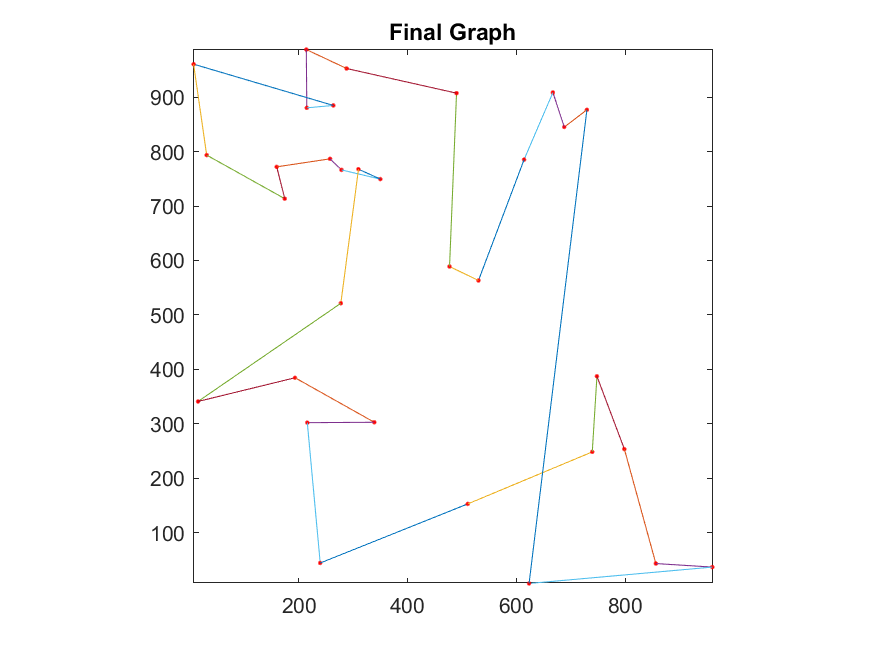

# Divide_and_Conquer_for_Solving_Traveling_Salesman_Problem_with_Ising_Model

## Table of contents

<!--ts-->
   * [Overview](#overview)
   * [Statement of the problem](#statement-of-the-problem)
   * [Introduction to the files](#introduction-to-the-files)
   * [Input file format](#input-file-format)
      * [Explanation of the inputs](#explanation-of-the-inputs)
   * [Algorithm](#algorithm)
      * [Divide and conquer](#divide-and-conquer)
      * [loosening the constraints](#loosening-the-constraints)
      * [Analysis of time complexity](#analysis-of-time-complexity)
         * [Time complexity of Ising model](#time-complexity-of-ising-model)
         * [Time complexity of clustering](#time-complexity-of-clustering)
         * [Summary time complexity](#summary-time-complexity)
   * [Figures of the route of this algorithm and the original algorithm](#figures-of-the-route-of-this-algorithm-and-the-original-algorithm)
      * [32 cities](#32-cities)
      * [64 cities](#64-cities)
      * [128 cities](#128-cities)
      * [256 cities](#256-cities)
      * [512 cities](#512-cities)
   * [References](#references)
<!--te-->

## Overview

   1. The algorithm in this repository solves the traveling salesman problem.
   2. The algorithm is the improved version of the algorithm in the repository [Solving_7_NP_hard_Problems_with_the_Ising_Model](https://github.com/richardyilin/Solving_7_NP_hard_Problems_with_the_Ising_Model). The Ising model is also applied to solve the traveling salesman problem.
   3. Divide and conquer is applied in the algorithm. The time complexity is reduced from $O(n^2t_{original})$ to $O(nkt)$, where *n* is the number of nodes, *k* is the upper bound of the number of a node in a cluster, *t<sub>original</sub>* is the number of times that the temperature is lowered in the original algorithm. *t* is the number of times that the temperature is lowered in this algorithm.
   4. The algorithm finds a shorter route by loosening the constraints first. Loosening the constraints increases the probability to find a shorter route but it could be invalid. Therefore, if the route is invalid, the constraints are set tighter and we find the route again. It repeats iteratively until it finds a valid route. The Ising model usually finds a valid route before the constraints are set as tight as the definition of the problem. Thus, it is more likely to obtain the shorter route than the original algorithm does, which sets the constraints the same as the constraints of the traveling salesman problem.
   5. For more details, please refer to the sections below.

## Statement of the problem
   1. We are given a map containing *n* nodes. The map contains the 2D Cartesian coordinates of *n* nodes. We need to find a route that visits each node exactly once and returns to the origin node. We want to minimize the length of the route.

## Introduction to the files

   1. [./src/TSP_divide_and_conquer.m](./src/TSP_divide_and_conquer.m): The algorithm this repository introduces.
   2. [./src/TSP_control_group.m](./src/TSP_control_group.m): The original algorithm.
   3. [./benchmarks](./benchmarks/): There are benchmarks for 32, 64, 128, 256, and 512 nodes, for k-means clustering and agglomerative clustering, and for euclidean distance and manhattan distance. The file name is named with the rule map_`number of nodes`_`clustering algorithm`_`distance`. For more information about the input file format, please refer to the next section [Input file format](#input-file-format).

## Input file format
```
clustering_algorithm
k
s
init
inc
d
n
x1 y1
x2 y2
. .
. .

xn yn

```

### Explanation of the inputs

   1. *clustering_algorithm*: *clustering_algorithm* denotes the clustering algorithm that is used to divide nodes. It can be either 1 or 2, where 1 denotes k-means clustering and 2 denotes agglomerative clustering.
   2. *k*: The nodes are divided into *k* clusters at each level. In this way, the size of the input of the Ising model each time is less or equal to *k*.
   3. *init*: *init* is the initial value of the exponent of A.
   4. *inc*: *inc* is the increment of the exponent of A when the Ising model fails to find a valid solution.
   5. *d*: *d* is the definition of distance. It can be either 1 or 2, where 1 denotes euclidean distance, and 2 denotes manhattan distance.
   6. *n*: *n* is the number of nodes.
   7. *x<sub>i</sub>* *y<sub>i</sub>*: *x<sub>i</sub>* *y<sub>i</sub>* is the coordinate of the *i*th node, where *i = 1, 2, ..., n*.

## Algorithm

### Divide and conquer
   1. Divide the nodes into *k* clusters, and each cluster contains a centroid.
   2. Sort all centroids with the Ising model.
   3. Repeat step 1 and step 2 until the number of nodes in the cluster is less than or equal to *k*.
   4. Sort the nodes in each cluster with the Ising model to obtain the order of nodes in each cluster.
   5. We merge clusters. We have already sorted the centroids when we were dividing the nodes. The order of the centroids is the order of the cluster. We connect the last node in the *i*th cluster, called *u*, to the first node of the *i+1* cluster, called *v*. That is, *e<sub>u</sub><sub>v</sub>* is in the route.
   6. We repeat step 5 from the last level to the first level. After that, we are done connecting from the first node in the route to the last node.
   7. Lastly, we connect the last node in the route to the first node. Now we obtain the complete route.

   

### loosening the constraints

   1. According to the paper ["Ising formulations of many NP problems"](https://www.frontiersin.org/articles/10.3389/fphy.2014.00005/full), the ising formulation of the traveling salesman problem is $$A\sum_{v=1}^n (1-\sum_{j=1}^n s_{v, j})^2 + A\sum_{j=1}^n (1-\sum_{v=1}^n s_{v, j})^2 + A\sum_{uv \notin E} \sum_{j=1}^n s_{u, j}s_{v, j+1} + B\sum_{uv\in E} W_{uv} \sum_{j=1}^n s_{u, j}s_{v, j+1}.$$
   2. To maintain the constraints of the traveling salesman problem, the formula $$\frac{A}{B} >= max(W_{uv})$$ needs to be satisfied. *max(W<sub>uv</sub>)* in this problem is the maximum distance between two nodes, and let it be *d<sub>max</sub>*. We can simply set $$A = max(d_{max})$$ and $$B = 1$$ for simplicity.
   3. We can try to set A less than *max(d<sub>max</sub>)*. In this way, it is more likely to obtain a shorter route although it might be invalid. To address the validity, we adopt the following technique.
   4. We first set $$A = d_{max}^{init}$$, where *init* is the initial value of the exponent and *init < 1*. We use the Ising model to find the route and check its validity. If it is valid, then it is the answer. Otherwise, we increases *A* by *d<sub>max</sub><sup>inc<sup>*. That is, $$A = A * d_{max}^{inc}$$
   5. We repeat step 4 until we find a valid answer.

### Analysis of time complexity

   This algorithm consists of two parts, the Ising model and clustering.
#### Time complexity of Ising model

   1. The time complexity of a single Ising model is $O(n^2ts)$, where *n* is the number of nodes and *t* is the number of times that the temperature is lowered, and *s* is the number of times *A* is increased. 
   2. $$O(s) = O(\frac{1-init}{inc}),$$ since we will find a valid answer when the exponent of *A* is 1.
   3. The upper bound of the number of nodes in an Ising model is *k*. Thus, the time complexity of an Ising model is $O(k^2ts)$.
   4. We sum up the time of all Ising models. We use the Ising model to sort the centroid at each level and the nodes in the clusters at the last level. Therefore, the number of times we use the Ising model is $$\sum_{i=0}^{log_{k} n - 1} k^i = \frac{\frac{n}{k} (1 - \frac{1}{k}^{log_{k} n})}{1 - \frac{1}{k}} = O(\frac{n}{k}).$$ We can ignore every term of $\frac{1}{k}$ since $k \geq 2$.
   5. Accordingly, the total time complexity of the operations of the Ising model is $O(k^{2}ts\frac{n}{k}) = O(nkts)$.

#### Time complexity of clustering

   1. The time complexity of k-means and agglomerative clustering are both $O(n^2)$, where *n* is the number of nodes that are clustered. The time complexity of agglomerative clustering is $O(n^2)$ because we adopt single-linkage clustering.
   2. At level *i* ( $i = 0, 1, ..., log_{k}^{n} - 1$ from top to bottom), $k^i$ clustering operations are perform and the the number of nodes in each operations is $(\frac{n^2}{k^i})^2$. Thus, the total time complexity of clusterings are $$\sum_{i=0}^{log_{k} n - 1} (\frac{n^2}{k^{i}})^2 k^i = \frac{n^2 (1 - \frac{1}{k}^{log_{k} n})}{1 - \frac{1}{k}} = O(n^2)$$.

#### Summary time complexity

   1. The total time complexity of this algorithm is $O(nkts + n^2)$. 
   2. The original algorithm is a single Ising model so the time complexity is $O(n^2t_{original})$.
   3. *t* is smaller than *t<sub>original</sub>* since the size of the input of the Ising model in this algorithm is smaller than that in the original algorithm. Thus, it is more likely to reach the ground state and takes less time.
   4. We can see that the divide and conquer method significantly improves the time complexity so we can trade the time for the quality of the route by trying to loosen the constraints.


## Figures of the route of this algorithm and the original algorithm

### 32 cities

#### Euclidean distance

   |  |
   |:--:|
   | 32 nodes with k-means clustering and Euclidean distance |

   |  |
   |:--:|
   | 32 nodes with agglomerative clustering and Euclidean distance |

   |  |
   |:--:|
   | 32 nodes with the original algorithm and Euclidean distance |

#### Manhattan distance

   |  |
   |:--:|
   | 32 nodes with k-means clustering and Manhattan distance |

   |  |
   |:--:|
   | 32 nodes with agglomerative clustering and Manhattan distance |

   |  |
   |:--:|
   | 32 nodes with the original algorithm and Manhattan distance |

### 64 cities

#### Euclidean distance

   |  |
   |:--:|
   | 64 nodes with k-means clustering and Euclidean distance |

   |  |
   |:--:|
   | 64 nodes with agglomerative clustering and Euclidean distance |

   |  |
   |:--:|
   | 64 nodes with the original algorithm and Euclidean distance |

#### Manhattan distance

   |  |
   |:--:|
   | 64 nodes with k-means clustering and Manhattan distance |

   |  |
   |:--:|
   | 64 nodes with agglomerative clustering and Manhattan distance |

   |  |
   |:--:|
   | 64 nodes with the original algorithm and Manhattan distance |

### 128 cities

#### Euclidean distance

   |  |
   |:--:|
   | 128 nodes with k-means clustering and Euclidean distance |

   |  |
   |:--:|
   | 128 nodes with agglomerative clustering and Euclidean distance |

   |  |
   |:--:|
   | 128 nodes with the original algorithm and Euclidean distance |

#### Manhattan distance

   |  |
   |:--:|
   | 128 nodes with k-means clustering and Manhattan distance |

   |  |
   |:--:|
   | 128 nodes with agglomerative clustering and Manhattan distance |

   |  |
   |:--:|
   | 128 nodes with the original algorithm and Manhattan distance |

### 256 cities

#### Euclidean distance

   |  |
   |:--:|
   | 256 nodes with k-means clustering and Euclidean distance |

   |  |
   |:--:|
   | 256 nodes with agglomerative clustering and Euclidean distance |

   |  |
   |:--:|
   | 256 nodes with the original algorithm and Euclidean distance |

#### Manhattan distance

   |  |
   |:--:|
   | 256 nodes with k-means clustering and Manhattan distance |

   |  |
   |:--:|
   | 256 nodes with agglomerative clustering and Manhattan distance |

   |  |
   |:--:|
   | 256 nodes with the original algorithm and Manhattan distance |

### 512 cities

#### Euclidean distance

   |  |
   |:--:|
   | 512 nodes with k-means clustering and Euclidean distance |

   |  |
   |:--:|
   | 512 nodes with agglomerative clustering and Euclidean distance |

   |  |
   |:--:|
   | 512 nodes with the original algorithm and Euclidean distance |

#### Manhattan distance

   |  |
   |:--:|
   | 512 nodes with k-means clustering and Manhattan distance |

   |  |
   |:--:|
   | 512 nodes with agglomerative clustering and Manhattan distance |

   |  |
   |:--:|
   | 512 nodes with the original algorithm and Manhattan distance |


## References

   1. [Clustering Approach for Solving Traveling Salesman Problems via Ising Model Based Solver](https://ieeexplore.ieee.org/abstract/document/9218695?casa_token=36149mXjomMAAAAA:yshItY8BRnvecVLmDbOq_iN1ccDF8D0TG2ResFrgRBQoYttjYXIUkTIpHX_BSJvqtjpb6Gjv)
   2. [Ising formulations of many NP problems](https://www.frontiersin.org/articles/10.3389/fphy.2014.00005/full)
   3. [Convergence of an annealing algorithm](https://link.springer.com/article/10.1007/BF01582166)